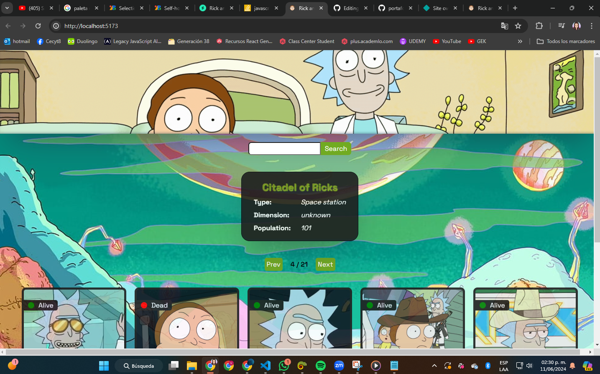
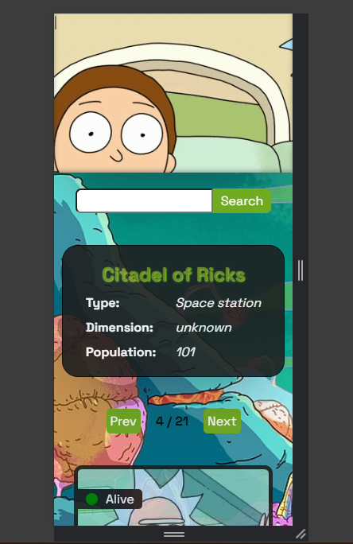

# Vianey Torres Cabrera

Este proyecto es realizado con el proposito de presentar mis habilidades como desarrollador Web Full-Stack. - 
Aplicación web que nos permite ver a todos los personajes de la serie de Rick and Morty por su locación utilizando su API.


[]

[]


## Características del Proyecto

- **Conceptos Aplicados **
- List and keys, input controlados, renderizado condicional y manejo de errores.
    - Custom Hook
    - List and keys
    - input controlados
    - renderizado condicional   
    - manejo de errores
    - Contacto

- **Diseño Responsive:** El proyecto está diseñado para adaptarse a diferentes dispositivos y tamaños de pantalla de PC, celular y tablet.
- **Input: **El area de formulario donde se debe introducir un numero entre 1 y 126, que son las locaciones existentes hasta el dia de hoy.   
- **Button-Search:** Al dar clic en ese boton se realiza la busqueda de la locacion.


- **Tecnologías utilizadas:**
   - HTML 
   - CSS
   - JavaScript
   - React
  
## Para la Ejecución de manera  local


1. **Clona el repositorio:** Ejecuta el siguiente comando en tu terminal para clonar este repositorio en tu máquina local:
```
git clone [https://github.com/VianeyTorresCabrera/entregable3_tcv/tree/main]
```

2. **Abre el proyecto:** Navega hasta la carpeta del proyecto clonado y abre el archivo `index.html` en tu navegador web.


## Contribución

Me encantaría recibir tu feedback hacerca de mis areas de mejora en cuanto al desarrollo de este proyecto 

## Contacto

Me gustaria atenderte de manera personal para resolver cualquier duda, puedes comunicarte conmigo en este enlace https://main--portafolio-vianey-torres.netlify.app/#contact
